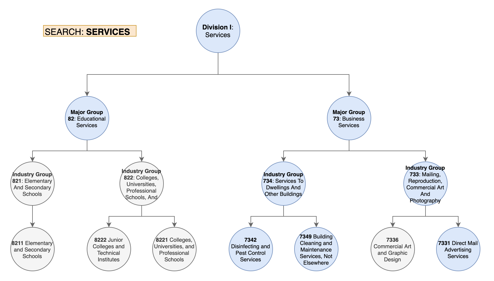

# Service: SIC Industries

This application contains a web-crawler that downloads industry information from an [official/public government page](https://www.osha.gov/pls/imis/sic_manual.html). The implementation relies on nested-structures (tree-like data), string operations, and recursive search using python.

You can install this python service by activating your virtual environment and executing:

```commandline
$ pip install -e services/sic_industries
```

Test the installation by running:

```commandline
$ python -m sic_industries url 
```

## Simple Usage

### CMD: `download`

You can download the industry catalog as a JSON file by running the following command:

```commandline
$ python -m sic_industries download industries.json
```

### CMD: `load`

You can load & show the industries via the `load` command:

```commandline
$ python -m sic_industries load --filename industries.json
```

## Exercise

In teams, work on implementing the following command:

### CMD: `search`

Use the `search` command to filter out the JSON structure and only show the values that match the search criteria.

There are two types of search:
* Exact Search: The industry title should contain the search criteria "as is".
* Similarity Search: The industry title should be similar to the criteria.

**Execution example**

```commandline
$ python -m sic_industries search --filename industries.json --title 'Nonclassifiable Establishments' --exact 
```

The python application should search within the nested-structure using a "contains" constraints. You can drop the `--exact` flag to specify similarity search.

**More examples with outputs**

Search for any industry title that contains the word "aquaculture": 

```text
$ python -m sic_industries search --filename industries.json --title 'aquaculture' --exact
[
    {
        "title": "Division A: Agriculture, Forestry, And Fishing",
        "children": [
            {
                "title": "Major Group 02: Agriculture production livestock and animal specialties",
                "children": [
                    {
                        "title": "Industry Group 027: Animal Specialties",
                        "children": [
                            {
                                "title": "0273 Animal Aquaculture",
                                "children": []
                            }
                        ]
                    }
                ]
            }
        ]
    }
]
``` 

Search for any industries that resemble the following: "no classifiable":

```text
$python -m sic_industries search --filename industries.json --title 'no classifiable'        
[
    {
        "title": "Division J: Public Administration ",
        "children": [
            {
                "title": "Major Group 99: Nonclassifiable Establishments",
                "children": [
                    {
                        "title": "Industry Group 999: Nonclassifiable Establishments",
                        "children": [
                            {
                                "title": "9999 Nonclassifiable Establishments",
                                "children": []
                            }
                        ]
                    }
                ]
            }
        ]
    }
]
```

## Visual Examples


